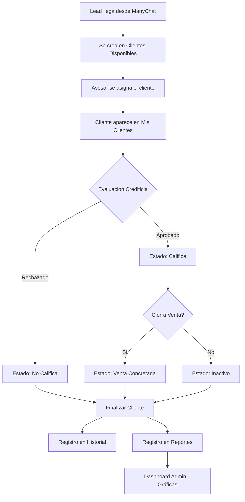

# 📱 ClientManager - CRM de Gestión de Leads y Ventas

<div align="center">


**Sistema CRM especializado para gestión de leads, evaluación crediticia y seguimiento de ventas multi-sucursal**

[🌐 Demo en Vivo](https://www.gestionclientes.app) • [Características](#-características) • [Instalación](#-instalación) • [Documentación](#-uso-del-sistema)

---

### 🚀 **SISTEMA EN PRODUCCIÓN**
**Accede al sistema en vivo:** [www.gestionclientes.app](https://www.gestionclientes.app)

</div>

---

## 📋 Tabla de Contenidos

- [Descripción del Proyecto](#-descripción-del-proyecto)
- [🌐 Demo en Vivo](#-demo-en-vivo)
- [Características Principales](#-características-principales)
- [Arquitectura del Sistema](#-arquitectura-del-sistema)
- [Tecnologías Utilizadas](#-tecnologías-utilizadas)
- [Requisitos Previos](#-requisitos-previos)
- [Instalación Local](#-instalación-local)
- [Deploy en Heroku](#-deploy-en-heroku)
- [Configuración](#-configuración)
- [Uso del Sistema](#-uso-del-sistema)
- [Estructura de Base de Datos](#-estructura-de-base-de-datos)
- [Flujo de Trabajo](#-flujo-de-trabajo)
- [Capturas de Pantalla](#-capturas-de-pantalla)
- [Roadmap](#-roadmap)
- [Contribuir](#-contribuir)
- [Licencia](#-licencia)
- [Contacto](#-contacto)

---

## 🎯 Descripción del Proyecto

**ClientManager** es un CRM (Customer Relationship Management) desarrollado para empresas de venta de productos con evaluación crediticia, especialmente diseñado para operaciones multi-sucursal. El sistema integra leads provenientes de ManyChat (WhatsApp Bot) y permite a los asesores de ventas gestionar el proceso completo desde la captación hasta el cierre de venta.

### 🌟 Estado del Proyecto
- ✅ **En Producción**: Actualmente operando en [www.gestionclientes.app](https://www.gestionclientes.app)
- ✅ **Deployment**: Heroku con dominio personalizado
- ✅ **Base de Datos**: PostgreSQL (Heroku Postgres)
- ✅ **SSL**: Certificado activo y configurado
- ✅ **Auto-scaling**: Configurado para alta demanda

### 🎯 Problema que Resuelve

Las empresas con múltiples sucursales y evaluación crediticia enfrentan:
- ❌ Leads perdidos por falta de seguimiento
- ❌ Duplicación de esfuerzos entre asesores
- ❌ Falta de visibilidad del proceso crediticio
- ❌ Dificultad para medir rendimiento por asesor/sucursal
- ❌ Comunicación ineficiente con clientes

### ✅ Solución Implementada

ClientManager ofrece:
- ✅ Centralización automática de leads desde WhatsApp
- ✅ Sistema de asignación libre con anti-colisión
- ✅ Flujo estructurado de evaluación crediticia
- ✅ Integración directa con WhatsApp Business
- ✅ Dashboard con analytics en tiempo real
- ✅ Sistema multi-sucursal con permisos por rol

### Caso de Uso Real

Desarrollado para una cadena de tiendas de venta de celulares con **9 sucursales**, donde los clientes potenciales llegan a través de un bot de WhatsApp (ManyChat) que recopila información básica (nombre, ubicación, teléfono, disponibilidad horaria). El sistema permite que cualquier asesor disponible pueda tomar el lead y gestionarlo hasta su conclusión.

---

## 🌐 Demo en Vivo

### 🔗 Acceso al Sistema
**URL Principal:** [https://www.gestionclientes.app](https://www.gestionclientes.app)

### 👤 Usuarios de Prueba

#### Cuenta Administrador (Ver Dashboard completo)
```
Email: andersson@akana.com
Password: 1321
```
**Acceso a:**
- ✅ Dashboard de reportes y analytics
- ✅ Gestión de todos los clientes
- ✅ Métricas de asesores y sucursales
- ✅ Exportación de reportes

#### Cuenta Asesor (Gestión de clientes)
```
Email: asesor1@akana.com
Password: 123456
```
**Acceso a:**
- ✅ Clientes disponibles
- ✅ Mis clientes asignados
- ✅ Cambio de estados
- ✅ WhatsApp integration

> ⚠️ **Nota:** Los datos de demo se reinician diariamente a las 00:00 UTC

---

## ✨ Características Principales

### 🎯 Gestión de Leads
- **Importación automática** desde Google Sheets (ManyChat)
- **Pool de clientes disponibles** visible para todos los asesores
- **Asignación en tiempo real** con sistema anti-colisión
- **Auto-refresh** cada 10 segundos (configurable)
- **Vista responsive** adaptada a móviles y tablets

### 👥 Sistema de Asesores
- **Asignación libre** de clientes disponibles
- **Panel "Mis Clientes"** con gestión completa
- **Cambio de estados** en tiempo real con colores
- **Integración directa** con WhatsApp Business
- **Historial completo** de interacciones

### 📊 Evaluación Crediticia
Estados del cliente configurables:
- 🟡 **Pendiente** - Lead recién asignado
- 🔵 **En Evaluación** - Proceso de análisis crediticio
- 🟢 **Califica** - Cliente aprobado
- 🔴 **No Califica** - Cliente rechazado
- 🟣 **Venta Concretada** - Cierre exitoso
- ⚫ **Inactivo** - Cliente sin respuesta

### 📈 Dashboard Administrativo
- **KPIs en tiempo real**: Total clientes, ventas, asesores, sucursales
- **Gráficas interactivas** (Chart.js):
  - Historial de atenciones (Line Chart)
  - Distribución por estados (Doughnut Chart)
  - Ventas por sucursal (Bar Chart)
  - Clientes por asesor (Bar Chart)
- **Filtros avanzados**: Por período y sucursal
- **Comparativas temporales**: vs período anterior
- **Exportación a Excel** de reportes

### 🔐 Sistema de Roles
- **Administrador**: Acceso completo + reportes y analytics
- **Asesor**: Gestión de clientes asignados únicamente

### 🏢 Multi-Sucursal
- Organización por 9 sucursales activas
- Métricas comparativas entre ubicaciones
- Asignación de asesores por sucursal

---

## 🏗️ Arquitectura del Sistema

```
┌─────────────────────────────────────────────────────────────┐
│                  EXTERNAL SOURCES                           │
│  ┌────────────┐      ┌─────────────┐                        │
│  │  ManyChat  │ ───► │Google Sheets│ ───► Import Script     │
│  │ (WhatsApp) │      │  (Temporal) │                        │
│  └────────────┘      └─────────────┘                        │
└─────────────────────────────────────────────────────────────┘
                            │
                            ▼
┌─────────────────────────────────────────────────────────────┐
│                 FRONTEND (Blade + Tailwind)                 │
│  ┌──────────────┐  ┌──────────────┐  ┌──────────────┐       │
│  │  Clientes    │  │ Mis Clientes │  │  Dashboard   │       │
│  │ Disponibles  │  │  (Asesores)  │  │   (Admin)    │       │
│  └──────────────┘  └──────────────┘  └──────────────┘       │
│         │                  │                  │             │
└─────────┼──────────────────┼──────────────────┼─────────────┘
          │                  │                  │
          └─────────► AJAX / Livewire ◄─────────┘
                            │
┌─────────────────────────────────────────────────────────────┐
│                 BACKEND (Laravel 12)                        │
│  ┌─────────────────────────────────────────────────────────┐│
│  │           Controllers & Business Logic                  ││
│  │  • ClienteController  • ReporteController               ││
│  │  • AuthController     • ProfileController               ││
│  └─────────────────────────────────────────────────────────┘│
│  ┌─────────────────────────────────────────────────────────┐│
│  │              Models & Relations                         ││
│  │  Cliente ↔ Asignacion ↔ User ↔ Sucursal                 ││
│  │  HistorialAtencion ↔ Reportes                           ││
│  └─────────────────────────────────────────────────────────┘│
└─────────────────────────────────────────────────────────────┘
                            │
                            ▼
┌─────────────────────────────────────────────────────────────┐
│              DATABASE (MySQL / JawsDB)                      │
│  • users  • clientes  • asignacions  • sucursales           │
│  • historial_atencion  • reportes                           │
└─────────────────────────────────────────────────────────────┘
                            │
                            ▼
┌─────────────────────────────────────────────────────────────┐
│                  PRODUCTION HOSTING                         │
│  • Heroku (App Deployment)                                  │
│  • JawsDB (MySQL Database)                                  │
│  • Name.com (Domain: www.gestionclientes.app)               │
└─────────────────────────────────────────────────────────────┘
```

---

## 🛠️ Tecnologías Utilizadas

### Backend
- **Laravel 12** - Framework PHP moderno
- **PHP 8.2+** - Lenguaje de programación
- **PostgreSQL** - Base de datos en producción (Heroku)
- **MySQL 8.0** - Base de datos en desarrollo local
- **Laravel Breeze** - Autenticación y scaffolding
- **Eloquent ORM**- Manejo de relaciones

### Frontend
- **Blade Templates** - Motor de plantillas de Laravel
- **Tailwind CSS 3** - Framework CSS utility-first
- **Alpine.js** - Framework JavaScript reactivo
- **Chart.js** - Gráficas interactivas (Dashboard personalizado)
- **Vanilla JavaScript** - Sin frameworks pesados
- **DataTables** - Tablas con búsqueda y paginación avanzada
- **jQuery 3.7** - Manipulación del DOM

### Deployment & Infraestructura
- **Heroku** - Platform as a Service (PaaS)
- **JawsDB MySQL** - Base de datos MySQL en Heroku
- **Name.com** - Registrador de dominio
- **Cloudflare** - DNS y CDN
- **SSL/TLS** - Certificado HTTPS activo
- **Git** - Control de versiones y deployment

### Herramientas de Desarrollo
- **Laragon** - Entorno de desarrollo local
- **Vite 7** - Build tool y hot reload
- **Composer** - Gestor de dependencias PHP
- **NPM** - Gestor de paquetes JavaScript

### Integraciones
- **ManyChat** - Bot de WhatsApp para captura de leads
- **Google Sheets** - Almacenamiento temporal de datos del bot
- **WhatsApp Business** - Comunicación directa con clientes

---

## 📋 Requisitos Previos

Antes de instalar localmente, asegúrate de tener:

```bash
- PHP >= 8.2
- Composer >= 2.6
- Node.js >= 18.x
- MySQL >= 8.0 (desarrollo local)
- Git
- Heroku CLI (para deployment)
```

### Extensiones PHP Requeridas
```
- OpenSSL
- PDO
- Mbstring
- Tokenizer
- XML
- Ctype
- JSON
- BCMath
```

---

## 📦 Instalación Local

### 1. Clonar el Repositorio

```bash
git clone https://github.com/AnderssonEspinoza/gestion-clientes-laravel.git
cd gestion-clientes-laravel
```

### 2. Instalar Dependencias PHP

```bash
composer install
```

### 3. Instalar Dependencias JavaScript

```bash
npm install
```

### 4. Configurar Variables de Entorno

```bash
cp .env.example .env
```

Edita `.env` con tus credenciales:

```env
APP_NAME=ClientManager
APP_URL=http://localhost
APP_ENV=local
APP_DEBUG=true

DB_CONNECTION=mysql
DB_HOST=127.0.0.1
DB_PORT=3306
DB_DATABASE=gestion_clientes
DB_USERNAME=root
DB_PASSWORD=

SESSION_DRIVER=file
SESSION_LIFETIME=120
SESSION_ENCRYPT=false
SESSION_SECURE_COOKIE=true
SESSION_HTTP_ONLY=true
SESSION_SAME_SITE=lax

QUEUE_CONNECTION=database
```

### 5. Generar Key de Aplicación

```bash
php artisan key:generate
```

### 6. Ejecutar Migraciones

```bash
php artisan migrate
```

### 7. Seeders (Opcional)

```bash
php artisan db:seed
```
Esto creará:
- ✅ 1 Administrador (andersson@akana.com / 1321)
- ✅ 5 Asesores (asesor1-5@akana.com / 123456)
- ✅ 9 Sucursales
- ✅ 16 Clientes de prueba

### 8. Compilar Assets

```bash
# Desarrollo
npm run dev

# Producción
npm run build
```

### 9. Iniciar Servidor

```bash
php artisan serve
```

Accede a: `http://localhost:8000`

---

## 🚀 Deploy en Heroku

### Configuración Inicial

1. **Instalar Heroku CLI**
```bash
# macOS
brew tap heroku/brew && brew install heroku

# Windows
# Descargar desde: https://devcenter.heroku.com/articles/heroku-cli
```

2. **Login en Heroku**
```bash
heroku login
```

3. **Crear aplicación**
```bash
# Crear app
heroku create gestion-clientes-app

# Agregar buildpack de PHP
heroku buildpacks:set heroku/php

# Agregar buildpack de Node.js (para compilar assets)
heroku buildpacks:add --index 1 heroku/nodejs
```

4. **Configurar Base de Datos**
```bash
# Agregar JawsDB MySQL (addon de Heroku)
heroku addons:create jawsdb:kitefin

# Verificar URL de la base de datos
heroku config:get JAWSDB_URL
```

### Variables de Entorno en Heroku

```bash
heroku config:set APP_NAME="ClientManager"
heroku config:set APP_ENV=production
heroku config:set APP_DEBUG=false
heroku config:set APP_URL=https://www.gestionclientes.app

# Generar y configurar APP_KEY
php artisan key:generate --show
heroku config:set APP_KEY="base64:TuKeyGenerada..."

# Configuración de sesión (CRÍTICO para evitar error 419)
heroku config:set SESSION_DRIVER=file
heroku config:set SESSION_LIFETIME=120
heroku config:set SESSION_ENCRYPT=false
heroku config:set SESSION_SECURE_COOKIE=true
heroku config:set SESSION_HTTP_ONLY=true
heroku config:set SESSION_SAME_SITE=lax
heroku config:unset SESSION_DOMAIN

# Queue configuration
heroku config:set QUEUE_CONNECTION=database

# Trust proxies (importante para Heroku)
heroku config:set TRUST_PROXIES='*'
```

### Archivos Necesarios

**Procfile** (crear en la raíz del proyecto):
```
web: vendor/bin/heroku-php-apache2 public/
```

**composer.json** (verificar):
```json
{
  "require": {
    "php": "^8.2",
    "laravel/framework": "^12.0"
  },
  "post-install-cmd": [
    "php artisan optimize:clear",
    "php artisan migrate --force"
  ]
}
```

#### Crear Script de Post-Deploy

Crea `heroku-postdeploy.sh`:

```bash
#!/bin/bash

echo "Running post-deploy tasks..."

# Limpiar cache
php artisan config:clear
php artisan cache:clear
php artisan route:clear
php artisan view:clear

# Optimizar para producción
php artisan config:cache
php artisan route:cache
php artisan view:cache

# Ejecutar migraciones (solo la primera vez)
# php artisan migrate --force

echo "Post-deploy tasks completed!"
```

Dar permisos de ejecución:
```bash
chmod +x heroku-postdeploy.sh
```
#### Compilar Assets para Producción

```bash
npm run build
```

#### Configurar .gitignore

Asegúrate de que `.gitignore` incluya:

```gitignore
/node_modules
/public/hot
/public/storage
/storage/*.key
/vendor
.env
.env.backup
.phpunit.result.cache
Homestead.json
Homestead.yaml
npm-debug.log
yarn-error.log

# NO ignorar public/build (assets compilados)
# !/public/build
```
### Deployment a Heroku

```bash
# 1. Commit de cambios
git add .
git commit -m "Deploy to Heroku"

# 2. Push a Heroku
git push heroku main

# 3. Ejecutar migraciones
heroku run php artisan migrate --force

# 4. Con seeders (opcional)
heroku run php artisan db:seed --force

# 5. Limpiar caché
heroku run "php artisan optimize:clear && rm -rf storage/framework/sessions/* storage/framework/cache/*"

# 6. Reiniciar
heroku restart

# 7. Ver logs
heroku logs --tail
```

### Configurar Dominio Personalizado

1. **Agregar dominio en Heroku**
```bash
# Agregar dominio desde Name.com
heroku domains:add www.gestionclientes.app

# Obtener DNS target
heroku domains
```

2. **Configurar DNS en Name.com** (o tu proveedor)
```
Tipo: CNAME
Host: www
Contenido: [tu-app].herokuapp.com
TTL: Automático
```

3. **Habilitar SSL automático**
```bash
heroku certs:auto:enable
```

### Troubleshooting Común

#### Error 419 (CSRF)
```bash
# Verificar middleware CSRF
# Ver app/Http/Middleware/VerifyCsrfToken.php

# Limpiar sesiones
heroku run "rm -rf storage/framework/sessions/*"
heroku restart
```

#### Error H10 (App Crashed)
```bash
# Ver logs
heroku logs --tail

# Verificar Procfile
# Verificar composer.json
# Verificar variables de entorno
```

---

## ⚙️ Configuración

### Crear Usuarios

#### Usuario Administrador
```bash
php artisan tinker
```

```php
User::create([
    'name' => 'Admin',
    'email' => 'admin@gestionclientes.app',
    'password' => bcrypt('password'),
    'role' => 'admin'
]);
```

#### Usuario Asesor
```php
User::create([
    'name' => 'Juan Pérez',
    'email' => 'juan@gestionclientes.app',
    'password' => bcrypt('password'),
    'role' => 'user',
    'sucursal_id' => 1
]);
```

### Crear Sucursales

```php
Sucursal::create([
    'nombre' => 'Sucursal Centro',
    'direccion' => 'Av. Principal 123',
    'telefono' => '987654321'
]);
```

---

## 🚀 Uso del Sistema

### Panel de Asesores

1. **Login** con credenciales de asesor
2. **Ver clientes disponibles** en la página principal (auto-refresh cada 10s)
3. **Asignarse un cliente** con el botón "Asignarme"
4. **Acceder a "Mis Clientes"** desde el menú
5. **Cambiar estados** según la evaluación crediticia
6. **Contactar vía WhatsApp** con un clic
7. **Finalizar cliente** cuando termine el proceso

### Panel Administrativo

1. **Login** con credenciales de admin
2. **Ver Dashboard de Reportes** desde el menú
3. **Analizar KPIs en tiempo real**:
   - Total de clientes
   - Ventas concretadas
   - Total de asesores activos
   - Total de sucursales
4. **Visualizar gráficas**:
   - Historial de atenciones (tendencia temporal)
   - Distribución de clientes por estado
   - Ventas por sucursal
   - Rendimiento por asesor
5. **Filtrar datos**:
   - Por período (Este mes, personalizado)
   - Por sucursal específica
6. **Exportar reportes** a Excel

---

## 🗄️ Estructura de Base de Datos

### Tablas Principales

#### `users`
```sql
- id
- name
- email
- password
- role (admin/user)
- sucursal_id (FK)
- timestamps
```

#### `clientes`
```sql
- id
- nombre
- email
- telefono
- ubicacion
- horario_disponibilidad
- estado (enum)
- notas_asesor
- timestamps
```

#### `asignacions`
```sql
- id
- cliente_id (FK)
- user_id (FK)
- estado (asignado/finalizado)
- timestamps
```

#### `sucursales`
```sql
- id
- nombre
- direccion
- telefono
- timestamps
```

#### `historial_atencion`
```sql
- id
- asignacion_id (FK)
- resultado
- observaciones
- fecha_atencion
- fecha_finalizacion
- timestamps
```

#### `reportes`
```sql
- id
- cliente_id (FK)
- user_id (FK)
- estado
- fecha_finalizacion
- observaciones
- timestamps
```

### Diagrama de Relaciones

```
┌─────────────┐         ┌──────────────┐         ┌─────────────┐
│   users     │──1───N──│ asignacions  │──N───1──│  clientes   │
│             │         │              │         │             │
│ id          │         │ id           │         │ id          │
│ name        │         │ cliente_id   │         │ nombre      │
│ email       │         │ user_id      │         │ email       │
│ role        │         │ estado       │         │ telefono    │
│ sucursal_id │         │ created_at   │         │ estado      │
└─────┬───────┘         └──────┬───────┘         └─────────────┘
      │                        │
      │                        │
      │                ┌───────▼──────────────┐
      │                │ historial_atencion   │
      │                │                      │
      │                │ id                   │
      │                │ asignacion_id        │
      │                │ resultado            │
      │                │ observaciones        │
      │                │ fecha_finalizacion   │
      │                └──────────────────────┘
      │
┌─────▼────────┐              ┌──────────────┐
│ sucursales   │              │  reportes    │
│              │              │              │
│ id           │              │ id           │
│ nombre       │              │ cliente_id   │
│ direccion    │              │ user_id      │
│ telefono     │              │ estado       │
└──────────────┘              │ fecha_fin    │
                              └──────────────┘
```

---

## 🔄 Flujo de Trabajo



---

## 📸 Capturas de Pantalla

### Vista de Clientes Disponibles

*Vista principal para asesores con auto-refresh y asignación en tiempo real*

### Panel Mis Clientes

*Gestión completa de clientes asignados con cambio de estados*

### Dashboard Administrativo

*Analytics en tiempo real con gráficas interactivas de Chart.js*

---

## 🗺️ Roadmap

### ✅ Versión 1.0 (Actual - En Producción)
- ✅ Sistema completo de gestión de leads
- ✅ Dashboard administrativo con Chart.js
- ✅ Sistema de roles (Admin/Asesor)
- ✅ Multi-sucursal (9 sucursales activas)
- ✅ Integración con WhatsApp
- ✅ Deploy en Heroku con dominio propio
- ✅ SSL configurado
- ✅ Auto-refresh en tiempo real

### 🔄 Versión 1.1 (En Desarrollo)
- [ ] Integración directa con API de ManyChat
- [ ] Sistema de comisiones por ventas
- [ ] Chat interno entre asesores
- [ ] Notificaciones push en tiempo real
- [ ] Exportación de reportes a PDF
- [ ] Modo oscuro (Dark mode)

### 📅 Versión 1.2 (Q2 2025)
- [ ] App móvil nativa (Flutter)
- [ ] Sistema de metas por asesor
- [ ] IA para scoring crediticio automático
- [ ] Integración con ERPs populares
- [ ] Multi-idioma (ES/EN)
- [ ] Sistema de calendarios y citas

### 🚀 Versión 2.0 (Q4 2025)
- [ ] Marketplace de integraciones
- [ ] API pública REST para terceros
- [ ] Sistema de tickets de soporte
- [ ] Gamificación para asesores
- [ ] Analytics predictivo con IA
- [ ] Integración con redes sociales

---

## 🤝 Contribuir

¡Las contribuciones son bienvenidas! Para contribuir:

1. Fork el proyecto
2. Crea una rama para tu feature (`git checkout -b feature/AmazingFeature`)
3. Commit tus cambios (`git commit -m 'Add: Amazing Feature'`)
4. Push a la rama (`git push origin feature/AmazingFeature`)
5. Abre un Pull Request

### Guía de Estilo
- Seguir PSR-12 para código PHP
- Usar Conventional Commits
- Escribir tests para nuevas features
- Documentar cambios en el CHANGELOG
- Probar en local antes de PR

### Reportar Bugs
Usa los [GitHub Issues](https://github.com/AnderssonEspinoza/gestion-clientes-laravel/issues) para reportar bugs:
1. Descripción clara del problema
2. Pasos para reproducir
3. Comportamiento esperado vs actual
4. Screenshots si aplica
5. Versión del sistema

---

## 📝 Licencia

Este proyecto está bajo la Licencia MIT. Ver archivo `LICENSE` para más detalles.

---

## 👨‍💻 Autor

**Andersson Espinoza M.**
- 🌐 Website: [www.gestionclientes.app](https://www.gestionclientes.app)
- 💼 GitHub: [@AnderssonEspinoza](https://github.com/AnderssonEspinoza)
- 💼 LinkedIn: [Andersson Espinoza M.](https://linkedin.com/in/andesp)
- 📧 Email: anderssonjunior.29@gmail.com

---

## 🙏 Agradecimientos

- **Laravel Framework** por la excelente documentación y comunidad
- **Tailwind CSS** por el sistema de diseño utility-first
- **Chart.js** por las visualizaciones profesionales
- **ManyChat** por la integración con WhatsApp Bot
- **Heroku** por la plataforma de deployment confiable
- **Name.com** por DNS 
- La **comunidad de Laravel** por el soporte constante

---

## 📊 Estadísticas del Proyecto

- ⭐ **Stars**: [GitHub Stars](https://github.com/AnderssonEspinoza/gestion-clientes-laravel)
- 🐛 **Issues Abiertos**: [Ver Issues](https://github.com/AnderssonEspinoza/gestion-clientes-laravel/issues)
- 🔀 **Pull Requests**: [Ver PRs](https://github.com/AnderssonEspinoza/gestion-clientes-laravel/pulls)
- 📦 **Versión Actual**: 1.0.0
- 🚀 **Estado**: Producción Activa
- 📅 **Última Actualización**: Noviembre 2025

---

## 📞 Soporte

¿Necesitas ayuda? Contáctame:
- 📧 Email: anderssonjunior.29@gmail.com
- 💬 GitHub Issues: [Crear Issue](https://github.com/AnderssonEspinoza/gestion-clientes-laravel/issues/new)
- 💼 LinkedIn: [Mensaje directo](https://linkedin.com/in/andesp)

---

<div align="center">

**⭐ Si este proyecto te fue útil, considera darle una estrella ⭐**

**🌐 Visita la aplicación en vivo: [www.gestionclientes.app](https://www.gestionclientes.app)**

---

Made with ❤️ by Andersson Espinoza M.


</div>