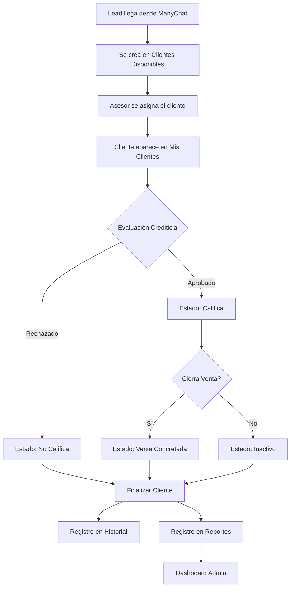
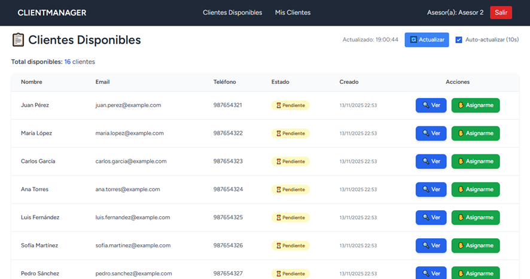
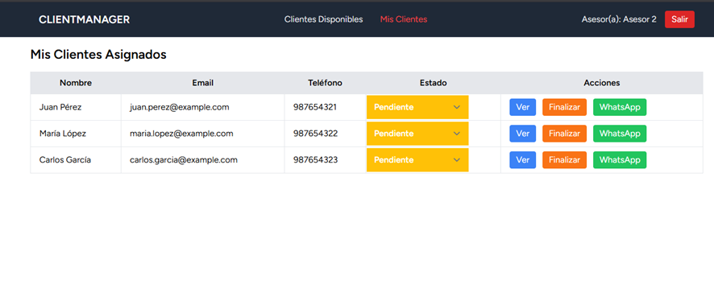
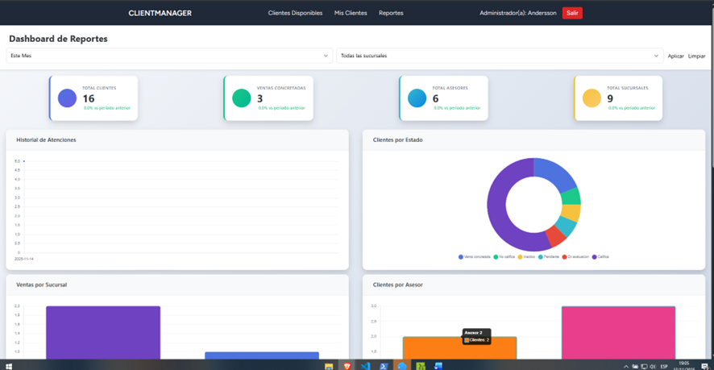

# 📱 ClientManager - CRM de Gestión de Leads y Ventas

<div align="center">


**Sistema CRM especializado para gestión de leads, evaluación crediticia y seguimiento de ventas multi-sucursal**

[Características](#-características) • [Instalación](#-instalación) • [Uso](#-uso) • [Tecnologías](#-tecnologías-utilizadas) • [Contribuir](#-contribuir)

</div>

---

## 📋 Tabla de Contenidos

- [Descripción del Proyecto](#-descripción-del-proyecto)
- [Características Principales](#-características-principales)
- [Arquitectura del Sistema](#-arquitectura-del-sistema)
- [Tecnologías Utilizadas](#-tecnologías-utilizadas)
- [Requisitos Previos](#-requisitos-previos)
- [Instalación](#-instalación)
- [Configuración](#-configuración)
- [Uso del Sistema](#-uso-del-sistema)
- [Estructura de Base de Datos](#-estructura-de-base-de-datos)
- [Flujo de Trabajo](#-flujo-de-trabajo)
- [Capturas de Pantalla](#-capturas-de-pantalla)
- [Roadmap](#-roadmap)
- [Contribuir](#-contribuir)
- [Licencia](#-licencia)
- [Contacto](#-contacto)

---

## 🎯 Descripción del Proyecto

**ClientManager** es un CRM (Customer Relationship Management) desarrollado para empresas de venta de productos con evaluación crediticia, especialmente diseñado para operaciones multi-sucursal. El sistema integra leads provenientes de ManyChat (WhatsApp Bot) y permite a los asesores de ventas gestionar el proceso completo desde la captación hasta el cierre de venta.

### Problema que Resuelve

Las empresas con múltiples sucursales que reciben leads desde canales digitales (como WhatsApp) necesitan:
- ✅ Centralizar y distribuir leads automáticamente
- ✅ Hacer seguimiento de evaluaciones crediticias
- ✅ Gestionar estados de clientes en tiempo real
- ✅ Medir rendimiento por asesor y sucursal
- ✅ Evitar duplicación de esfuerzos entre asesores

### Caso de Uso Real

Desarrollado para una cadena de tiendas de venta de celulares con **9 sucursales**, donde los clientes potenciales llegan a través de un bot de WhatsApp (ManyChat) que recopila información básica (nombre, ubicación, teléfono, disponibilidad horaria). El sistema permite que cualquier asesor disponible pueda tomar el lead y gestionarlo hasta su conclusión.

---

## ✨ Características Principales

### 🎯 Gestión de Leads
- **Importación automática** desde Google Sheets (ManyChat)
- **Pool de clientes disponibles** visible para todos los asesores
- **Asignación en tiempo real** con sistema anti-colisión
- **Auto-refresh** cada 10 segundos (configurable)
- **Vista responsive** adaptada a móviles y tablets

### 👥 Sistema de Asesores
- **Asignación libre** de clientes disponibles
- **Panel "Mis Clientes"** con gestión completa
- **Cambio de estados** en tiempo real con colores
- **Integración directa** con WhatsApp Business
- **Historial completo** de interacciones

### 📊 Evaluación Crediticia
Estados del cliente configurables:
- 🟡 **Pendiente** - Lead recién asignado
- 🔵 **En Evaluación** - Proceso de análisis crediticio
- 🟢 **Califica** - Cliente aprobado
- 🔴 **No Califica** - Cliente rechazado
- 🟣 **Venta Concretada** - Cierre exitoso
- ⚫ **Inactivo** - Cliente sin respuesta

### 📈 Dashboard Administrativo
- **KPIs en tiempo real**: Total clientes, ventas, asesores, sucursales
- **Gráficas interactivas** (Chart.js):
  - Historial de atenciones
  - Distribución por estados
  - Ranking de ventas por asesor
  - Comparativa por sucursal
- **Tabla de asesores** con búsqueda y filtros
- **Exportación a Excel** de reportes

### 🔐 Sistema de Roles
- **Administrador**: Acceso completo + reportes y analytics
- **Asesor**: Gestión de clientes asignados únicamente

### 🏢 Multi-Sucursal
- Organización por sucursales
- Métricas comparativas entre ubicaciones
- Asignación de asesores por sucursal

---

## 🏗️ Arquitectura del Sistema

```
┌─────────────────────────────────────────────────────────────┐
│                      FRONTEND (Blade + Tailwind)            │
│  ┌──────────────┐  ┌──────────────┐  ┌──────────────┐       │
│  │  Clientes    │  │ Mis Clientes │  │  Dashboard   │       │
│  │ Disponibles  │  │  (Asesores)  │  │   (Admin)    │       │
│  └──────────────┘  └──────────────┘  └──────────────┘       │
└─────────────────────────────────────────────────────────────┘
                            ↕ AJAX / Livewire
┌─────────────────────────────────────────────────────────────┐
│                    BACKEND (Laravel 12)                     │
│  ┌──────────────────────────────────────────────────────┐   │
│  │              Controllers & Business Logic            │   │
│  │  • ClienteController  • ReporteController            │   │
│  │  • AuthController     • ProfileController            │   │
│  └──────────────────────────────────────────────────────┘   │
│  ┌──────────────────────────────────────────────────────┐   │
│  │                  Models & Relations                  │   │
│  │  Cliente → Asignacion → User → Sucursal              │   │
│  └──────────────────────────────────────────────────────┘   │
└─────────────────────────────────────────────────────────────┘
                            ↕
┌─────────────────────────────────────────────────────────────┐
│                   DATABASE (MySQL)                          │
│  • users  • clientes  • asignacions  • sucursales           │
│  • historial_atencion  • reportes                           │
└─────────────────────────────────────────────────────────────┘
                            ↕
┌─────────────────────────────────────────────────────────────┐
│              EXTERNAL INTEGRATIONS                          │
│  • ManyChat (WhatsApp Bot) → Google Sheets → Import         │
│  • WhatsApp Business API (Direct Contact)                   │
└─────────────────────────────────────────────────────────────┘
```

---

## 🛠️ Tecnologías Utilizadas

### Backend
- **Laravel 12** - Framework PHP moderno
- **PHP 8.2+** - Lenguaje de programación
- **MySQL 8.0** - Base de datos relacional
- **Laravel Breeze** - Autenticación y scaffolding

### Frontend
- **Blade Templates** - Motor de plantillas de Laravel
- **Tailwind CSS 3** - Framework CSS utility-first
- **Alpine.js** - Framework JavaScript reactivo
- **Chart.js** - Gráficas interactivas
- **DataTables** - Tablas con búsqueda y paginación avanzada

### Herramientas de Desarrollo
- **Laragon** - Entorno de desarrollo local
- **Vite** - Build tool y hot reload
- **Composer** - Gestor de dependencias PHP
- **NPM** - Gestor de paquetes JavaScript

### Integraciones
- **ManyChat** - Bot de WhatsApp para captura de leads
- **Google Sheets** - Almacenamiento temporal de datos del bot
- **WhatsApp Business** - Comunicación directa con clientes

---

## 📋 Requisitos Previos

Antes de instalar, asegúrate de tener:

```bash
- PHP >= 8.2
- Composer >= 2.6
- Node.js >= 18.x
- MySQL >= 8.0
- Git
```

### Extensiones PHP Requeridas
```
- OpenSSL
- PDO
- Mbstring
- Tokenizer
- XML
- Ctype
- JSON
- BCMath
```

---

## 📦 Instalación

### 1. Clonar el Repositorio

```bash
git clone https://github.com/AnderssonEspinoza/gestion-clientes-laravel.git
cd clientmanager
```

### 2. Instalar Dependencias PHP

```bash
composer install
```

### 3. Instalar Dependencias JavaScript

```bash
npm install
```

### 4. Configurar Variables de Entorno

```bash
cp .env.example .env
```

Edita `.env` con tus credenciales:

```env
APP_NAME=ClientManager
APP_URL=http://localhost

DB_CONNECTION=mysql
DB_HOST=127.0.0.1
DB_PORT=3306
DB_DATABASE=gestion_clientes
DB_USERNAME=root
DB_PASSWORD=

QUEUE_CONNECTION=database
```

### 5. Generar Key de Aplicación

```bash
php artisan key:generate
```

### 6. Ejecutar Migraciones

```bash
php artisan migrate
```

### 7. Seeders (Opcional)

```bash
php artisan db:seed
```

### 8. Compilar Assets

```bash
# Desarrollo
npm run dev

# Producción
npm run build
```

### 9. Iniciar Servidor

```bash
php artisan serve
```

Accede a: `http://localhost:8000`

---

## ⚙️ Configuración

### Crear Usuarios

#### Usuario Administrador
```bash
php artisan tinker
```

```php
User::create([
    'name' => 'Admin',
    'email' => 'admin@clientmanager.com',
    'password' => bcrypt('password'),
    'role' => 'admin'
]);
```

#### Usuario Asesor
```php
User::create([
    'name' => 'Juan Pérez',
    'email' => 'juan@clientmanager.com',
    'password' => bcrypt('password'),
    'role' => 'user',
    'sucursal_id' => 1
]);
```

### Crear Sucursales

```php
Sucursal::create([
    'nombre' => 'Sucursal Centro',
    'direccion' => 'Av. Principal 123',
    'telefono' => '987654321'
]);
```

---

## 🚀 Uso del Sistema

### Panel de Asesores

1. **Login** con credenciales de asesor
2. **Ver clientes disponibles** en la página principal
3. **Asignarse un cliente** con el botón "Asignarme"
4. **Acceder a "Mis Clientes"** desde el menú
5. **Cambiar estados** según la evaluación
6. **Contactar vía WhatsApp** con un clic
7. **Finalizar cliente** cuando termine el proceso

### Panel Administrativo

1. **Login** con credenciales de admin
2. **Ver reportes** desde el menú
3. **Analizar KPIs** en tiempo real
4. **Filtrar por período y sucursal**
5. **Exportar datos** para análisis externo

---

## 🗄️ Estructura de Base de Datos

### Tablas Principales

#### `users`
```sql
- id
- name
- email
- password
- role (admin/user)
- sucursal_id (FK)
- timestamps
```

#### `clientes`
```sql
- id
- nombre
- email
- telefono
- ubicacion
- horario_disponibilidad
- estado (enum)
- notas_asesor
- timestamps
```

#### `asignacions`
```sql
- id
- cliente_id (FK)
- user_id (FK)
- estado (asignado/finalizado)
- timestamps
```

#### `historial_atencion`
```sql
- id
- asignacion_id (FK)
- resultado
- observaciones
- fecha_atencion
- fecha_finalizacion
- timestamps
```

#### `reportes`
```sql
- id
- cliente_id (FK)
- user_id (FK)
- estado
- fecha_finalizacion
- observaciones
- timestamps
```

### Diagrama de Relaciones

```
users (1) ──── (N) asignacions (N) ──── (1) clientes
  │                                           │
  │                                           │
  └─── (N) sucursales                        │
                                              │
asignacions (1) ──── (N) historial_atencion
```

---

## 🔄 Flujo de Trabajo



---

## 📸 Capturas de Pantalla

*(Aquí puedes agregar screenshots cuando subas el proyecto)*

### Vista de Clientes Disponibles


### Panel Mis Clientes


### Dashboard Administrativo


---

## 🗺️ Roadmap

### Versión 1.1 (Próxima)
- [ ] Notificaciones push en tiempo real
- [ ] Integración directa con API de ManyChat
- [ ] Sistema de comisiones por ventas
- [ ] Chat interno entre asesores
- [ ] Exportación automática de reportes

### Versión 1.2 (Futuro)
- [ ] App móvil nativa (Flutter)
- [ ] Sistema de metas por asesor
- [ ] IA para scoring crediticio automático
- [ ] Integración con ERPs populares
- [ ] Multi-idioma

### Versión 2.0 (Visión)
- [ ] Marketplace de integraciones
- [ ] API pública para terceros
- [ ] Sistema de tickets de soporte
- [ ] Gamificación para asesores

---

## 🤝 Contribuir

¡Las contribuciones son bienvenidas! Para contribuir:

1. Fork el proyecto
2. Crea una rama para tu feature (`git checkout -b feature/AmazingFeature`)
3. Commit tus cambios (`git commit -m 'Add: Amazing Feature'`)
4. Push a la rama (`git push origin feature/AmazingFeature`)
5. Abre un Pull Request

### Guía de Estilo
- Seguir PSR-12 para código PHP
- Usar Conventional Commits
- Escribir tests para nuevas features
- Documentar cambios en el CHANGELOG

---

## 📝 Licencia

Este proyecto está bajo la Licencia MIT. Ver archivo `LICENSE` para más detalles.

---

## 👨‍💻 Autor

**Tu Nombre**
- GitHub: [@AnderssonEspinoza](https://github.com/AnderssonEspinoza)
- LinkedIn: [Andersson Espinoza M.](https://linkedin.com/in/andesp)
- Email: anderssonjunior.29@ejemplo.com

---

## 🙏 Agradecimientos

- Laravel Framework por la excelente documentación
- Tailwind CSS por el sistema de diseño
- Chart.js por las visualizaciones
- ManyChat por la integración con WhatsApp
- La comunidad de Laravel

---


<div align="center">

**⭐ Si este proyecto te fue útil, considera darle una estrella ⭐**

Made with ❤️ by Andersson Espinoza

</div>